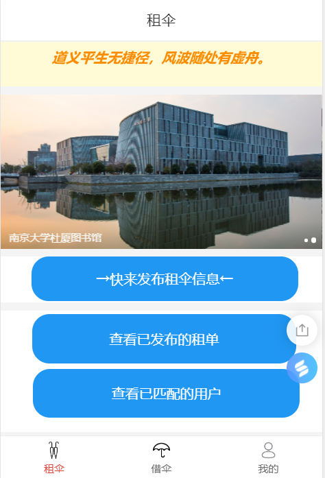
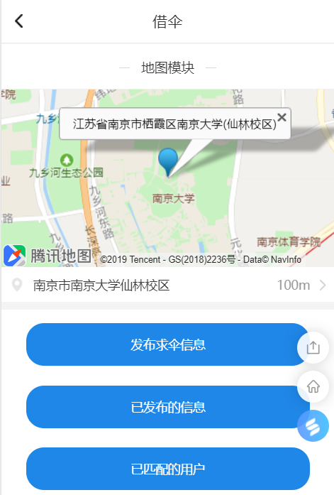
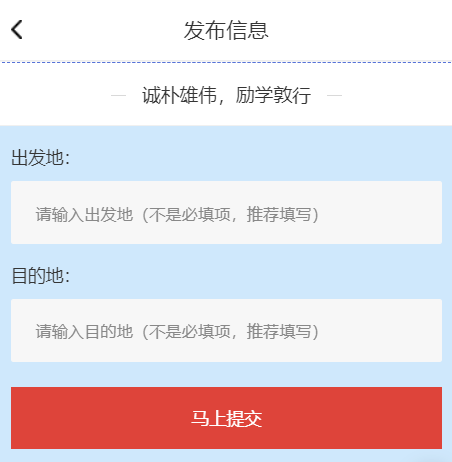
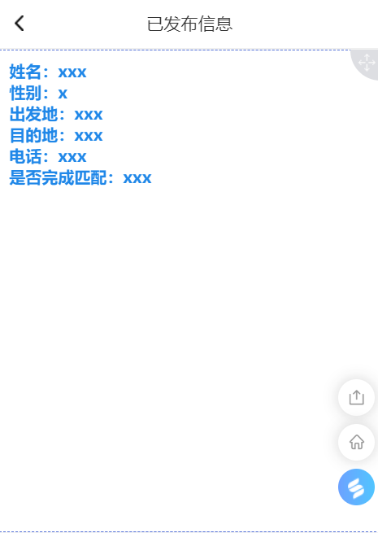
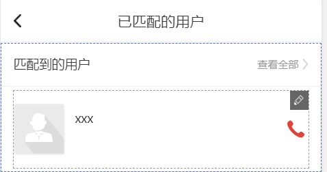
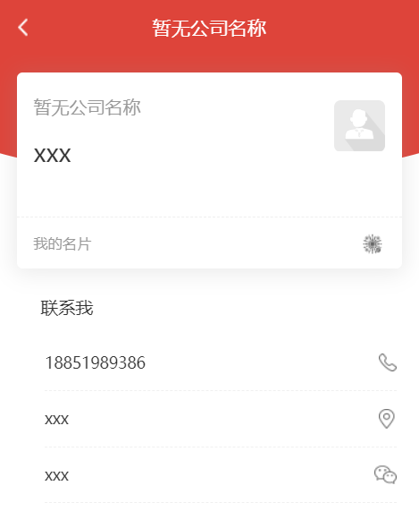

# 金融软件工程项目 Umber 设计报告

## 引言

### 报告撰写目的

本工程设计了一个基于微信小程序的雨伞共享平台 Umber，功能有：用户基础信息录入、寻伞用户发布寻伞信息、供伞用户寻求寻伞信息、供需双方最优匹配、订单完成与评价激励等。

本报告是为实现在最短时间内以最小代价确定设计该雨伞共享平台的问题是否可以解决，完成对该项目的设计，从而进一步确定开发的流程步骤。

### 项目背景

日常生活中，几乎每个人都会遇到过下雨天忘带伞的情况，此外，许多男生更是面临着在暴晒天气却不好意思打伞的窘境。在这类情况下，此类人群便需要及时高效地寻找到一个能够与他们共享雨伞的人。此外，人与人之间共享雨伞亦可促进沟通、提供结交新朋友的可能性。许多单位目前有此类功能性社群（如QQ群），但此类社群存在消息延迟、消息有效性不明确、无法匹配推荐等缺点。

基于以上真实用户需求和社群的缺陷，并考虑到该供需关系主要限制于一个单位内（如某高校），本工程意在设计一个建立在微信小程序基础上的雨伞共享平台，在一定地理范围内集成发布寻伞信息、寻求寻伞信息、供需双方最优匹配推荐、订单完成与评价激励等功能，提高信息有效性和匹配效率，从而为广大用户提供生活便利，同时为用户提交社交方式的新选择。

## 小组成员与分工

陈昌繁：后端开发

石霭青：前端开发

史健均：前端开发

朱梓源：产品经理，后端开发

## 可行性分析

### 系统基本要求

#### 采用架构

本工程采用微信小程序技术架构，框架包含视图层与逻辑层。视图层由wxml与wxss共同实现页面结构表现，逻辑层由js进行逻辑处理、接口调用等，结构清晰明了。

#### 运行环境

微信移动客户端。

### 系统开发要求

#### 开发环境搭建

微信官方开发者工具。[下载地址](https://developers.weixin.qq.com/miniprogram/dev/devtools/download.html)

#### 费用开支与收益分析

开发过程将全部采用开源接口与框架。本项目为软件工程课程小组项目，所需开发与维护人员为小组同学。故各项费用开支预计为0。

本工程为非盈利性质，纯经济效益为0。

### 其他各因素的可行性分析

#### 人员可行性

本工程小组成员各自有一定的前端或后端开发经历，且目前对于本工程在各方面达成了一致。

#### 可用性分析

由于无需关心经济效益，预计可用性较佳。

### 可行性分析总结

上述可行性分析基于开源接口与框架，参考现有开发资料、文档等资源，考虑成本与效益，最终确定本项目具备进一步进行需求分析与后续开发条件。

## 功能与体系结构

### 基本需求分析

基于小程序的特点，本工程将实现一个平台的基本功能：登入、个人信息完善、个人信息查看等。基于用户需求（分为寻伞用户与供伞用户）和开放接口，本工程将实现寻伞用户的寻伞信息发布、供伞用户对于寻伞信息的主动查看、供需双方在出发地与目的地意义上的最优匹配推荐、配对成功后的订单完成与用户评价激励等功能。

### 功能性分析

#### 注册

用户在初次登录的时候，通过微信接口创建账号，同时需要提供姓名、学号、院系、基本的联系方式等信息来完善账号，此后便能正式开始使用小程序，联系方式将在未来使用时双方配对成功后被提供给对方用户。

#### 发布寻伞消息

当用户希望寻求雨伞时，在发布页面填写一个表格，包括：

* 地理位置与相应地标信息（可由api获取准确坐标或由用户自行填写校园地标，如：逸夫楼）。
* 目的地。
* 提供的积分奖励。

每一条消息仅有5分钟的有效时间。在有效时间之后，寻伞消息就会被撤销，以保证消息有效性。

#### 查看寻伞消息

当用户希望提供雨伞时，可以在一个专门的页面中查看现在的所有寻伞消息。除此之外，用户还可以对寻伞消息进行筛选，找出符合自己行程的寻伞消息，并确认匹配。

#### 匹配

当提供雨伞的用户确定领取一条寻伞消息后：

* 寻伞用户收到一条服务通知，得到供伞者的联系方式。
* 供伞用户自动收藏寻伞消息，以在个人中心查看。
* 供伞用户从寻伞消息中获取寻伞用户联系方式。

积分奖励在一定时间（寻伞用户确认）后发放，发放前如果有联系不上等情况导致供伞失败，则由寻伞用户提出，积分奖励不发放。

#### 个人中心

用户可以在个人中心查看自己发布/收藏的消息。消息在7天后自动清除。

此外还可以查看自己的积分，分享给好友等。

## 界面设计图与使用场景图

**1.租伞：**

上面可设计一条每日一句，可中文可英文，也可设计成可滑动样式；

图片可设计成精选壁纸，或南大美丽照片；

下面是三个功能。后面有介绍。

**2.借伞：**

上方地图，预计求助者能看到周边有伞的人，同时能看到自己的地理位置。

发布信息一样需要出发点和地址；

查看已发布的信息，这里面是有伞的同学所发布的所有租伞信息，我们根据距离等因素排序，从上到下展示最方便的信息，供用户选择。用户选择后点击信息，会弹出对话框，是否同意，同意即可完成匹配，我们会提示被匹配到的租伞用户。

在已匹配的用户里面，用户可以看到对方的信息，其中包括姓名，性别，联系电话，地址等。

**3.我的：**

我的里面暂时打算设计出一个头像框，头像框下面是自己的积分，下方有三行列表，第一行个人信息的修改；第二行，历史已完成单目；第三行，积分商城；

第一行：个人信息包括：用户头像，可以上传各种照片；用户用户名，姓名，性别，学号，院系，专业，联系电话。，微信号和个人介绍（爱好等，均为选填）。

如果个人信息必填项未完成，则无法接单和发单；同时必填项用于验证学生身份。

第二行：历史已完成的，既有作为租伞者也有作为求伞者的单的信息。包括时间，出发地，目的地，匹配的用户等；

第三行：积分商城，这里可以看到积分可以兑换的物品和奖励。如果真实赞助的话，要注意兑换后扣除分的措施。比如扫二维码等。

最下方是退出登录。

**4.发布信息：**

**5.已发布的信息：**

此处已发布信息里，姓名可以用网名代替，因为登录时已经完善个人信息，出于用户的隐私性，可以不显示姓名。其他信息均为必要信息。

**6.已匹配到的用户：**

这里能看到已匹配到用户信息，是名片形式，点开后可看到此人

与上图类似，如果可以，通过访问电话权限，可以直接进行呼叫。

用户之间呼叫联络，确定见面地点。至此一个互助单已完成。

若求助用户未能联系上租伞用户，则在程序中反馈。打算求助者的已匹配的用户信息里，加上是否找到租伞者，是否完成订单。